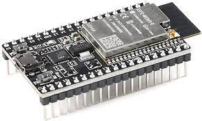
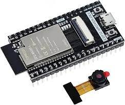
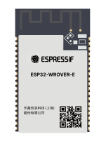
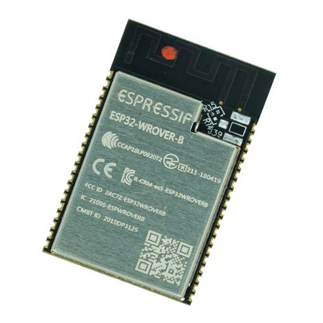

# NymphCast Audio - ESP32 #

This repository contains the source code for the firmware of NymphCast Audio, targeting the ESP32 platform as supported by the Espressif ESP-IDF SDK. 

[NymphCast](https://github.com/MayaPosch/NymphCast) is a multi-platform visual-audio streaming system that allows anyone to stream local multimedia content from NymphCast media servers and clients to receivers (NymphCast Server). NymphCast Audio is one such receiver, with as difference that it does not support video output.

The NymphCast Audio - ESP32 (NCA-ESP32) project is an implementation of NymphCast Audio on the Espressif ESP32 platform, offering the following features:

- Auto-discovery using NyanSD.
- Streaming of most audio and video formats (audio track only).
- Playback of online (RTSP) streams and similar.

## Compatible Hardware ##

Hardware characteristics & requirements:

- 4+ MB Flash
- 4 MB PSRAM
- ESP32 (dual-core, 240 MHz, or equivalent derivative).
- I2S audio codec like the UDA1334A.

**Supported boards:**

| Image | Type | Description |
|--- | --- | --- |
|| ESP32-DevKitC V4 - ESP32-WROVER-E | Version of the official [Espressif ESP32-DevKitC V4](https://docs.espressif.com/projects/esp-idf/en/latest/esp32/hw-reference/esp32/get-started-devkitc.html) with ESP32-WROVER-E module (see modules section). |
|| ESP32-WROVER-DEV | Originally produced by [Freenove](https://github.com/Freenove/Freenove_ESP32_WROVER_Board). Very similar to the ESP32-DevKitC V4 (above), but with one extra GND and 5V pin, as well as a camera module. Uses same ESP32-WROVER-E module (see modules section). |

**Supported modules:**

| Image | Type | Description |
|--- | --- | --- |
|| Espressif ESP32-WROVER-E module. | 4 MB Flash, 8 MB PSRAM. Has v3 silicon, with PSRAM cache and other bugs fixed. The ESP32-WROVER-IE variant has an external antenna. Found on the official ESP32-DevkitC V4 boards, the Freenove ESP32-WROVER-DEV and other boards. |
|| Espressif ESP32-WROVER-B module | Has 4 MB Flash, 8 MB PSRAM, with v2 silicon. Requires PSRAM cache workaround. The ESP32-WROVER-IB variant has an external antenna. Found on older Espressif development boards and third-party boards. |

Most development and testing has been performed using the ESP32-WROVER-E and ESP32-WROVER-B modules, specifically the Freenove ESP32-WROVER-DEV (WROVER-E) board, which is almost identical to the official [Espressif ESP32-DevKitC V4](https://docs.espressif.com/projects/esp-idf/en/latest/esp32/hw-reference/esp32/get-started-devkitc.html) development board with ESP32-WROVER-E module.

**Supported I2S codecs:**
<table>
<tr>
<th>
Image</th><th>Description</th></tr>
<tr>
<td width="50%"><image src="art/UDA1334A-i2s-digital-audio-breakout_778x507.jpg" height="40%"></td>
<td>NXP UDA1334A-based I2S codec with stereo output. Board is usually found with the model ID _CMJCU-1334_ and is available from a wide variety of sources.</td>
</table>

## Hardware Wiring ##

Based on an I2S codec like the UDA1334A with its three-wire I2S interface, these should be wired up as follows:

|Name	| GPIO|
|-------|-------|
|BCLK	| 14|
|WSEL	| 15|
|DATA	| 13|

## ESP-IDF Project ##

As an ESP-IDF 5.x project, its requirements for building the firmware include only a recent copy of ESP-IDF 5.x from Espressif.

Following this, use the ESP-IDF shell or local equivalent to navigate to the top folder of the NCA-ESP32 project after cloning or downloading it to a local folder.

Here the WiFi credentials should be updated in the `wifi_stuff.h` header file (creating this file from the provided template as needed) so that the new NCA-ESP32 device can connect to the local WiFi network.

In the top folder, create a new folder `build` and navigate into it, before executing `cmake .. -G "Ninja"`. This will create the build files separate from the project files. 

After running `ninja`, the project should successfully build and can be flashed to a connected (and compatible) ESP32 module with `ninja flash`.

## Project Details ##

As said, the project is a basic ESP-IDF 5.x project with no external dependencies. The included dependencies are found in the `components` folder and are:

| Name | Description
|------|---------
|libavutil 		| Ffmpeg library.
|libswresample 	| Ffmpeg library.
|libswscale	 	| Ffmpeg library.
|libavcodec 	| Ffmpeg library.
|libavdevice 	| Ffmpeg library.
|libavfilter 	| Ffmpeg library.
|libavformat 	| Ffmpeg library.
|NPocoCore 		| [NPoco](https://github.com/MayaPosch/NPoco) portable components core.
|NPocoNet		| [NPoco](https://github.com/MayaPosch/NPoco): portable network components.
|NyanSD			| [NyanSD](https://github.com/MayaPosch/NyanSD): service discovery 
|NymphRPC		| [NymphRPC](https://github.com/MayaPosch/NymphRPC): remote procedure call library.

The **Ffmpeg** libraries were compiled using audio-only presets and optimised for size. In-memory tables and similar constant data were relocated to Flash or PSRAM. All internal Ffmpeg audio-related codecs are supported.

**NPoco** is a fork of the Poco desktop libraries, adapted for MCU usage and with FreeRTOS support added. It acts as the hardware abstraction layer for the main NymphCast code.

**NyanSD** is a lightweight, UDP broadcast-based discovery library. It was adapted for NCA-ESP32 due to the limitations of the ESP-IDF (and LwIP) environment. It enables NCA-ESP32 devices to be discovered on the local network.

**NymphRPC** is the Remote Procedure Call library that underlies all network communication between NymphCast servers and clients. It's a highly optimised, zero-copy RPC implementation that provides low-latency, high-throughput commands and data transfers for use with NymphCast.

## Missing Features ##

With the ESP32 being such a resource restricted platform, the NCA-ESP32 implementation misses one feature from the full NCA implementation: the AngelScript-based NymphCast Apps. There currently is no realistic way that this feature could be added to this MCU platform.

## Known Issues ##

- **WiFi**: auto-discovery of WiFi-connected NCA-ESP32 instance by WiFi-connected client fails, but works reliably for Ethernet-connected clients.